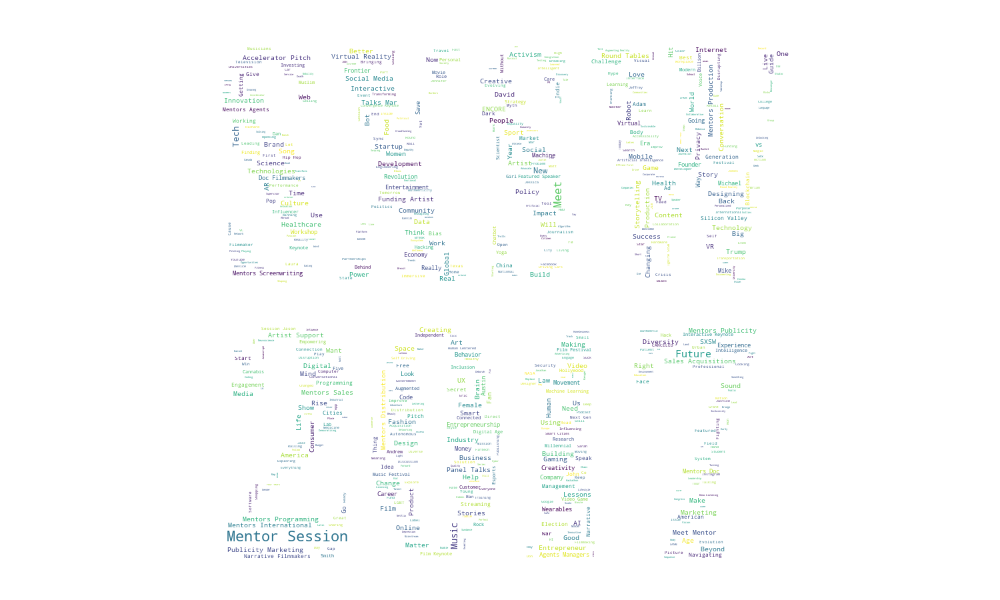
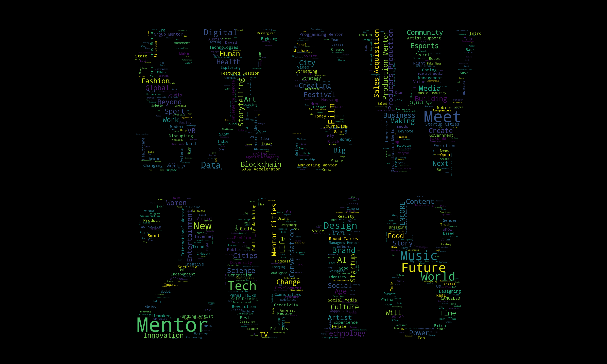

# SXSW-WordCloud
Python + SXSW + Adobe Illustrator + Web Scraping (Beautiful Soup) + WordCloud

To learn more about the Word Cloud Script I used: https://github.com/amueller/word_cloud

## Examples

To extract SXSW Title Data check out 

Check out  generates the Word Clouds. A sample output is:

